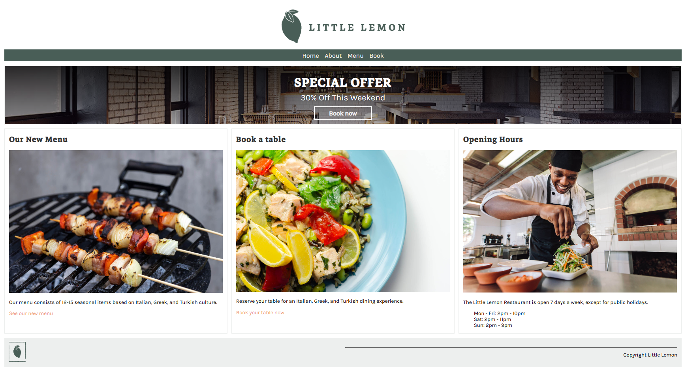

# Little_Lemon_Meta

## Installation
### 1. Clone the repository
```
git clone https://github.com/thangthewinner/Little_Lemon_Meta.git
cd Little_Lemon_Meta
```

### 2. Set up a virtual environment 
```
.\env\Scripts\activate
```

### 3. Run application
```
cd littlelemon
python manage.py runserver
```

### 4. Optional
The admin account when you access to `.../admin/` website is:
- username: admin
- password: 123  

## Overview
This is the final project of the Meta Django Programming course. 

Course link: [https://www.coursera.org/learn/django-web-framework/](https://www.coursera.org/learn/django-web-framework/).

## Web Preview
